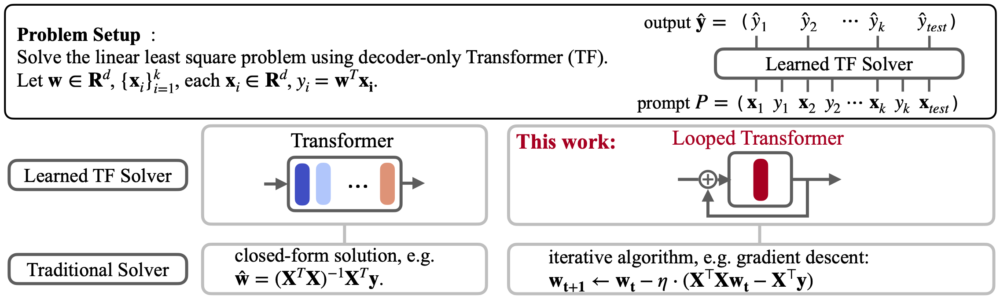

# Experiments with Looped Transformer from Yang et al.
The code of this repo is based on https://github.com/Leiay/looped_transformer. You can find the paper in [arxiv](https://arxiv.org/abs/2311.12424).


## Overview

Describe the results and work: 

  1) Optimization of training
  2) Probing
     
     The biggest constraint was the training time. This entailed training for only 1 target probe and early stop for the MLP on the loop Transformer run.
  
  3) Dilation - does it allow to boost performance ?

### Optimization of the training


<p align="center" width="100%">
    
</p>


## Setup
The PyTorch version has been upgraded to 2.2.2. Please install and activate the environment through
```shell
conda env create -f environment.yml
conda activate loop_tf
```

## Running Experiments
1) For looped transformer with dilated `n_loop_window` training, refer to and execute  `bash exec/script_loop_dilated.sh`.
2) For probing experiments:

   2.1. Train transformer models
    ```shell
    # Unloop run for comparison and training time 
    python scripts/train.py --config configs/base_cheap.yaml --wandb.name "LR_baseline-n_embd=128" --gpu.n_gpu 0 --model.n_embd=128 --training.train_steps=100000 --training.curriculum.points.end=41 --model.n_layer 20

    # Loop run with many steps
    # b=100 T=20
    python scripts/train.py --config configs/base_loop_cheap.yaml --model.n_layer 1  --training.curriculum.loops.start 20  --training.curriculum.loops.end 100   --training.n_loop_window 20   --wandb.name "LR_loop_L1_ends{100}_T{20}"  --gpu.n_gpu 0 --model.n_embd=128 --training.train_steps=100000 --training.curriculum.points.end=41 
    ```
    2.2 Train the probing model
   ```shell
   # Probe script
   python scripts/model_probe.py --lr 0.001 --target-mode "Wols" --n-gpus 0 --wandb-name "Prob-base-hyp1"
   ```
3) To plot and compare with baseline methods, refer to notebooks in the `jupyter_notebooks` folder.
