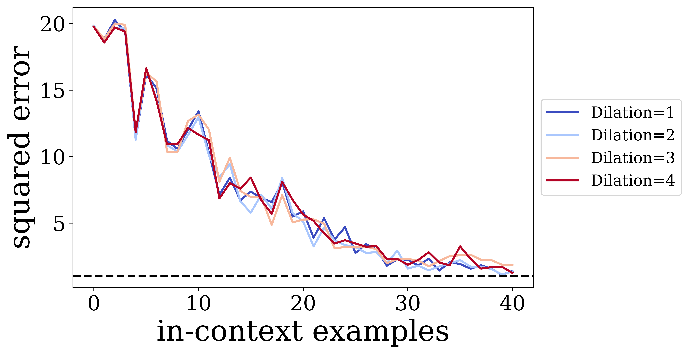

# Experiments with Looped Transformer from Yang et al.
The code of this repo is based on https://github.com/Leiay/looped_transformer. You can find the paper in [arxiv](https://arxiv.org/abs/2311.12424).


## Overview

### 1) Optimization of the training in my experiments

1) The `training.train_steps` hparam was reduced to 100k (probing exp) and 150k (dilation exp) values.
2) The `model.n_embd` hparam was reduced to 128 (probing exp) and 64 (dilation exp).

The reduction of `training.curriculum.dims.end` was tried, but it does not reduce the time significantly, so it was omitted.

    
### 2) Probing MSE divergence experiment

  Commenting the Fig. 8 of the original paper, the authors stated:
   > "Contrasting with the standard transformer, which decodes the target probe optimally around the 10-th layer, the looped transformer steadily refines its representation, improving the decoding of the target probe with each subsequent loop iteration."
   
   The idea of this experiment is to check whether the looped transformer indeed "consistently refines its representations related to the target probes", or the probe error deterioration will also happen, akin to the unlooped transformer case. If latter, it might mean that the looped transformer employes the same mechanisms as the standard one, but, due to fewer layers, the same processes happen slower.

   The procedure of the experiment follows the section 5.3 of the original paper. The results can be seen at Fig.1. The probe error of the looped transformer does not increase as the loop iteration approches the last one. This can possibly mean that the information inside of the looped transformer is being processed differently. Perhaps the regression task is solved earlier in the unlooped transformer model, and the latter, non-specific to this task, layers entangle the representation, but this is only the speculation. Unfortunately, even the unlooped transformer behaviour does not fully match the paper's results because the probe error does not increase heavily in the end, but this can stem from the optimized training setup that saves time.

   <p align="center" width="100%">
    
     <em>Figure 1: How do the transformer and the looped transformer encode information across layers/iterations ? Two-layer MLP probing model is trained to recover the target probe from the transformer’s output at t-th layer/loop iteration. The number of layers is 20 and loops is 100. </em>
    </p>

   The biggest constraint of this experiment was the training time. This entailed training for only 1 target probe, no control task, and an early stop for the MLP on the loop Transformer run. The MLP for the looped transformer wasn’t trained for the 10k steps due to the great time complexity, approximately 5400 steps were done only.
  
### 3) Dilated `n_loop_window` training - does it allow to boost performance ?

The idea of this experiment is to check how does the performance of the model changes if it uses not just `T` last loop iterations, but every 2nd/3rd/4th last iterations. The motivation was to enhance the performance by paying more attention to the earlier loop iterations. The hyperparams for the runs are `b=60`, `n_loop_window=15`.

The dilated `n_loop_window` seems to not yield any significant differences on the performance, see Fig. 2. This can stem from the same reason the Scheduled Training procedure does not impact the outcome significantly as the authors state in section 5.1: 
> In general, the decision to use or not to use the scheduling does not significantly impact the outcome.

   <p align="center" width="100%">
    
     <em>Figure 2: MSE over in-context examples for different dilation values of `n_loop_window`, `b=60`, `n_loop_window=15`. </em>
    </p>

Maybe the `model.n_embd` hyperparameter is too low to spot any difference. Nevertheless, the earlier loops are involved in the gradient calculation anyway, so the dilation might only harm the performance.

## Setup
The PyTorch version has been upgraded to 2.2.2. Please install and activate the environment through
```shell
conda env create -f environment.yml
conda activate loop_tf
```

## Running Experiments
1) For looped transformer with dilated `n_loop_window` training, refer to and execute  `bash exec/script_loop_dilated.sh`. To plot and compare runs with different dilations, refer to notebook `jupyter_notebooks/Figures_dilated_loops.ipynb`.
 
2) For probing experiments:

   2.1. Train transformer models
    ```shell
    # Unloop run for comparison and training time 
    python scripts/train.py --config configs/base_cheap.yaml --wandb.name "LR_baseline-n_embd=128" --gpu.n_gpu 0 --model.n_embd=128 --training.train_steps=100000 --training.curriculum.points.end=41 --model.n_layer 20

    # Loop run with many steps
    # b=100 T=20
    python scripts/train.py --config configs/base_loop_cheap.yaml --model.n_layer 1  --training.curriculum.loops.start 20  --training.curriculum.loops.end 100   --training.n_loop_window 20   --wandb.name "LR_loop_L1_ends{100}_T{20}"  --gpu.n_gpu 0 --model.n_embd=128 --training.train_steps=100000 --training.curriculum.points.end=41 
    ```
    2.2. Train the probing model
   ```shell
   # Probe script
   python scripts/model_probe.py --lr 0.001 --target-mode "Wols" --n-gpus 0 --wandb-name "Prob-base-hyp1"
   ```
    2.3. To plot the probing MSE refer to the notebook `model_probing_plot_result_point2.ipynb`
